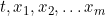
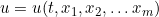
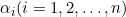
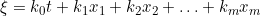
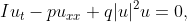

# GiNaCDE- an NLPDE solver
[](https://opensource.org/licenses/MIT)

GiNaCDE is an NLPDE (Nonlinear Partial Differential Equation) and NLODE (Nonlinear Ordinary Differential Equation) solver written in C++. It has three different methods: F-expansion, modified F-expansion (mF-expansion), and first integral method (FIM) for solving NLPDEs and NLODEs. It can be used to get exact analytical traveling-wave solutions of a wide variety of NLPDEs arising in different scientific community fields.
The library has been designed to solve the NLPDEs, which have the following general form


where  are independent variables,  is dependent variable,  are the parameters. Here *F* must be a polynomial about *u* and its derivatives.
GiNaCDE always transforms the NLPDE into an NLODE with respect to the traveling-wave coordinate  using a traveling-wave transformation.
F-expansion and modified F-expansion methods can be applied to higher-order NLPDEs. But, FIM is applicable to an NLPDE when its transformed NLODE with respect to the traveling-wave coordinate  is second-order only.
However, there is no guarantee that the library always gives the complete solutions of all NLPDEs of the above form. Sometimes, the library may fail to give solutions due to the complexity of the problems.


## Features
Some interesting features of GiNaCDE are

  * Available solution methods: F-expansion method, modified F-expansion method, and first integral method.
  * It can solve  NLPDEs or NLODEs that contain complex functions.
  * It can tackle the non-polynomial form of *h (X)* in the case of FIM.
  * It can integrate an integrable NLPDE or NLODE when possible, and the generated integrating constants can be assigned with the values in the user choice.
  * For differential equations with parameters, e.g. , it can determine the conditions on the parameters to obtain exact solutions.
  * The exact analytical solutions of NLPDEs or NLODES with calculating steps are saved in a text file written in `MAPLE` or `MATHEMATICA` language.
  * It has a friendly Graphical User Interface (GUI).

 
## External dependency
GiNaCDE V1.0.0 requires the following packages (install the packages in the following order):

   * [CLN >= 1.3.4](http://www.ginac.de/CLN/). This library is mandatory. We have provided the source codes for this library in [extlib/](extlib/) folder. At first, we should install this library, and to install this library use the following commands:  
```        
        $ ./configure
        $ make
        $ make install
```
  * [GiNaC >= 1.7.6](https://www.ginac.de/archives/). This library is mandatory.
       We have provided the source codes for this library in [extlib/](extlib/) folder. To install this library use the following commands:
```        
        $ ./configure
        $ make
        $ make install
```
  *  [GTK+ 3.xx](https://download-fallback.gnome.org/sources/gtk+/3.24/). This library is optional and is used to build the GUI version of the GiNaCDE library. This GUI library can be installed on UBUNTU OS easily by the command:
```
        $ sudo apt install libgtk-3-dev
```   

## Compiling and installing
Compilations are done using the tools [CMake](https://cmake.org/download/) `>= 3.1`, pkg-config `>=0.29.2`, and of course, a compiler that supports `>= C++11`.
We suggest to use the C++ compiler from the GNU compiler collection, `GCC >= 4.9`. GiNaCDE can then be compiled using the commands: 
```
     $ mkdir build-dir # generate a separate directory
     $ cd build-dir
     $ cmake -DGINACDE_GUI_BUILD=on <path-to-source> # generate Makefiles
     $ make
     $ make install
```
A successful compilation will lead to the creation of libraries, executables of gtools, and GiNaCDE GUI. If you do not want to build GiNaCDE GUI, use the following option:
```
    -DGINACDE_GUI_BUILD=off
```
`gtools` is a console application.
    
## Tests
The [`test`](test/) folder contains tests. These tests can be executed using the commands:
```
    $ ctest
```
These automated tests verify the functionality of the software. 
## Execution
GiNaCDE library can be executed in C++ code with GNU compiler collection, `GCC >= 4.9`. To run `GiNaCDE GUI`, 
`gtools` just click on `GiNaCDE_gui.exe`, `gtools.exe` files respectively. Then GiNaCDE GUI is executed in a GUI framework, 
but `gtools` is executed in a console.  
To run the GiNaCDE library from the GCC compiler, use the following command:
```  
    $ g++ -std=c++11 -Wall -g example.cpp -o example -lcln -lginac -lGiNaCDE
```   
## Output
GiNaCDE prints all the output results in a separate text ('.txt') file.
Besides this, the solutions of the NLPDE are collected by a programming variable *solutionClt*.

## Examples
The [`examples`](examples/) folder contains all the examples which solve some NLPDEs, such as, Eckhaus equation, Seventh-order SawadaKotara equations, Fifth-order Generalized KdV equation, Perturbed NLS Equation with Kerr Law Nonlinearity, KudryashovSinelshchikov Equation, etc.
We have provided output text files after executing each example. 
    
### Additional notes
Please note that one can obtain different results in output files compared to those provided by us in the [`examples`](examples/) folder for each example. 
This happens because of the GiNaC library.
Because GiNaC assigns a unique (hidden) serial number for each newly created symbol object and GiNaC uses this unique serial number instead of its name for algebraic manipulations. The serial number for the same name of the symbol may be changed in each running session of the GiNaC program. As a result, the symbols in the same algebraic expressions may be ordered differently during each running session of the GiNaC program. This happens because to order the symbols of an algebraic expression GiNaC internally uses a comparison predicate, called *ex_is_less*, which uses an internal symbol id counter. 

## Documentation: 
The documentation for GiNaCDE is available [`here`](doc/documentation.pdf).
The short tutorials on `GiNaCDE GUI` and `gtools` are also available [`here`](doc/GiNaCDE_guiTutorial.pdf) and [`here`](doc/gtoolsTutorial.pdf), respectively.
    
## Example usage  
This is a brief example that computes exact solutions of the following one-dimensional cubic nonlinear Schrödinger (NLS) equation:



where *p* and *q* are are non-zero real constants and *u(x,t)* is a complex-valued function depends on the variables *t,x*.
For a more detailed introduction, please refer to the [documentation](doc/documentation.pdf) file.  
```c++
/** @file NLS.cpp
 *
 *   This program solves one dimensional cubic nonlinear Schr\"odinger (NLS) equation:
        Iu_t-pu_{xx}+q{|u|}^2u=0, 
 **/

#include <GiNaCDE/GiNaCDE.h>

int main()
{
    const ex u=reader("u"), t=reader("t"), x=reader("x"), k_0=reader("k_0"), k_1=reader("k_1"),
             p_0=reader("p_0"), p_1=reader("p_1"), A_0=reader("A_0"),A_2=reader("A_2"),
             p=reader("p"),q=reader("q");

    const ex pde = I*Diff(u,t,1) - p*Diff(u,x,2) + q*u*u*conjugate(u);

    depend(u, {t, x});

    output=maple;
    twcPhase=lst{lst{k_0,k_1},lst{p_0,p_1}};
    degAcoeff=lst{2,A_0,0,A_2};
    ASolve=false;
    positivePart=true;
    negativePart=true;
    paraInDiffSolve=lst{};
    filename="NLS_Fexp.txt";
    desolve(pde,{u},F_expansion);

    output=mathematica;
    filename="NLS_FIM.txt";
    desolve(pde, {u}, FIM);

    return 0;

}
```
After compiling and running the above program, exact solutions with calculating steps are saved in the text files [NLS_Fexp.txt](examples/NLS_Fexp.txt) and [NLS_FIM.txt](examples/NLS_FIM.txt). 

## GUI build
We have provided a pe-compiled GiNaCDE GUI, which can be downloaded from [here](GUI/GiNaCDE_GUI.rar). The GiNaCDE GUI has been compiled on Windows 10 OS using [`MSYS2`](https://www.msys2.org), GCC 10.3.0, GTK+ 3.24.30, CLN 1.3.6 and GiNaC 1.8.1. The precompiled software is compatible with 32-bit and 64-bit Windows 10 OS.

    
## Contributions and bug reports
Contributions to this project are very welcome.
If you wish to contribute a new feature, you can do this by forking the GiNaCDE repo and creating a branch. Apply your code changes to the branch on your fork. When you're done, submit a [pull request](https://github.com/mithun218/GiNaCDE/pulls) to merge your fork into master branch with a tag "enhancement", and the proposed changes can be discussed there. 

If you encounter a bug, please open a new [issue](https://github.com/mithun218/GiNaCDE/issues/new) on the GitHub repository to report the bug, and tag it "bug".

Please provide sufficient information to reproduce the bug and include as much information as possible that can be helpful for fixing it.
